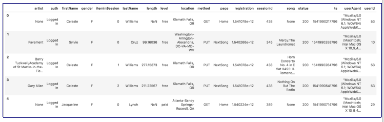
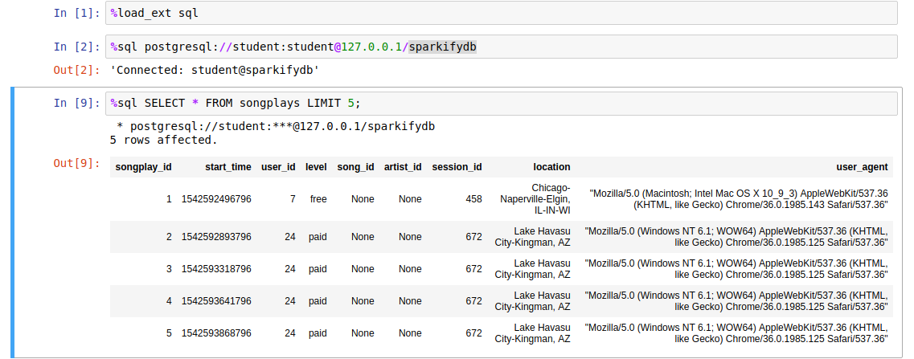
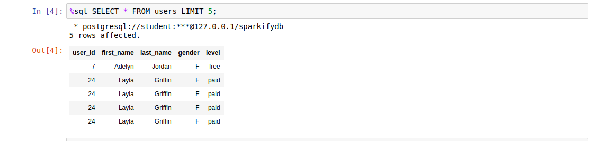
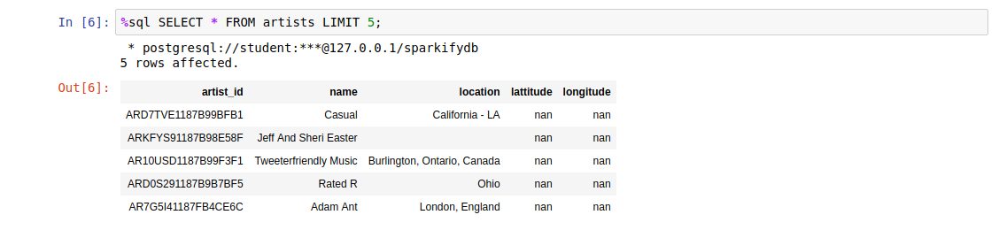
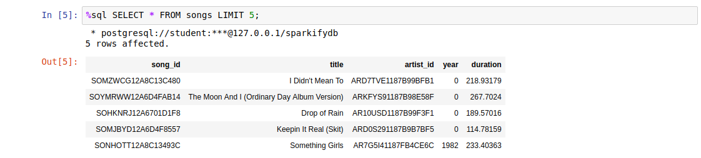
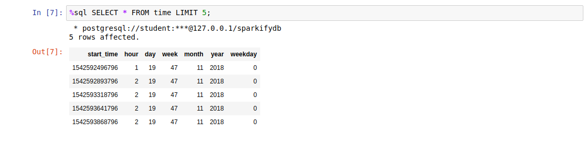

# DEND PROJECT 1 - ETL PROCESSING - Data Modeling with POSTGRES
A startup called Sparkify wants to analyze the data they've been collecting on songs and user activity on their new music streaming app. The analytics team is particularly interested in understanding what songs users are listening to. Currently, they don't have an easy way to query their data, which resides in a directory of JSON logs on user activity on the app, as well as a directory with JSON metadata on the songs in their app.

Sparkify asked to create a Postgres database with tables designed to optimize queries on song play analysis. The task is to create a database schema and ETL pipeline for this analysis. Two datasets are provided to develop the application:
* Songs dataset
* Log dataset

## song dataset
The first dataset is a subset of real data from the Million Song Dataset. Each file is in JSON format and contains metadata about a song and the artist of that song. The files are partitioned by the first three letters of each song's track ID. For example, here are filepaths to two files in this dataset.

```
song_data/A/B/C/TRABCEI128F424C983.json
song_data/A/A/B/TRAABJL12903CDCF1A.json
```
And below is an example of what a single song file, TRAABJL12903CDCF1A.json, looks like.
```
{"num_songs": 1, "artist_id": "ARJIE2Y1187B994AB7", "artist_latitude": null, "artist_longitude": null, "artist_location": "", "artist_name": "Line Renaud", "song_id": "SOUPIRU12A6D4FA1E1", "title": "Der Kleine Dompfaff", "duration": 152.92036, "year": 0}
```

## log dataset
The second dataset consists of log files in JSON format generated by this event simulator based on the songs in the dataset above. These simulate app activity logs from a music streaming app based on specified configurations.
The log files in the dataset you'll be working with are partitioned by year and month. For example, here are filepaths to two files in this dataset.

```
log_data/2018/11/2018-11-12-events.json
log_data/2018/11/2018-11-13-events.json
```


## Schema for Song Play Analysis
I decided to create only a primary key in the fact table

### FACT table
1. songplays
```
CREATE TABLE IF NOT EXISTS songplays(
    songplay_id SERIAL PRIMARY KEY, 
    start_time varchar, 
    user_id varchar, 
    level varchar, 
    song_id varchar, 
    artist_id varchar, 
    session_id varchar, 
    location varchar, 
    user_agent varchar)
```

### DIMENSION tables
2. users
```
CREATE TABLE IF NOT EXISTS users(
    user_id varchar, 
    first_name varchar, 
    last_name varchar, 
    gender varchar, 
    level varchar)
```
3. songs
```
CREATE TABLE IF NOT EXISTS songs(
    song_id varchar, 
    title varchar, 
    artist_id varchar, 
    year int, 
    duration float)
```
4. artists
```
CREATE TABLE IF NOT EXISTS artists(
    artist_id varchar, 
    name varchar, 
    location varchar, 
    lattitude float, 
    longitude float)
```
5. time
```
CREATE TABLE IF NOT EXISTS time(
    start_time varchar, 
    hour int, 
    day int, 
    week int, 
    month int,
    year int,
    weekday int)
```
The data model makes it easy to select a song. 
 ```
SELECT songs.song_id, artists.artist_id
    FROM (songs JOIN artists
    ON songs.artist_id = artists.artist_id)
    WHERE (songs.title=%s) AND (artists.name=%s) AND (songs.duration=%s)
```
## Running the code
from a terminal window
```
python create_tables.py
```
The python code connects to a database. it first drops the tables and recreates all tables.
Once all tables are created run the etl.py script
```
python etl.py
```

The notebook test provides an easy way to check the results. A Jupiter notebook is used to run the code.
Starting jupyter note is as simple as typing
```
jupyter notebook
```
from there open the test.ipynb and run each cell to retrieve the top 5 rows of each table





